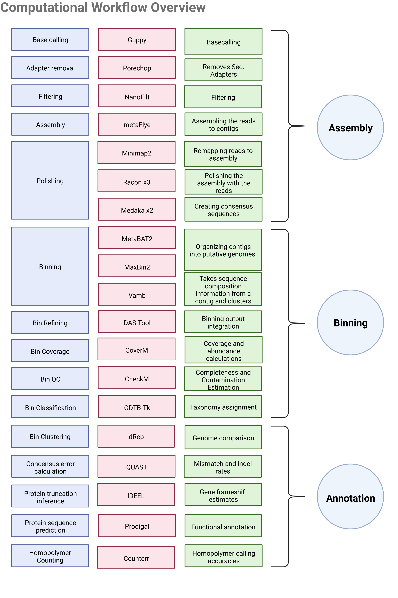

# Air_Metagenomics

# Nanopore Sequencing Data Analysis Pipeline

This repository contains a pipeline for the analysis of Oxford Nanopore sequencing data. The pipeline uses the following tools:

1. **Guppy Basecaller**: This software tool, provided by Oxford Nanopore Technologies (ONT), is used to convert the raw electrical signal data from nanopore sequencing into DNA sequences, a process known as basecalling.

2. **Porechop**: This tool is developed for Oxford Nanopore sequencing data. It finds and removes adapters from Oxford Nanopore reads.

3. **NanoFilt**: This is a simple tool to filter Oxford Nanopore sequencing data. It reads in a FASTQ file (or stdin), filters reads based on a minimum quality and/or a minimum length, and writes out the filtered reads to stdout.

4. **Flye**: This is a de novo assembler for single-molecule sequencing reads, such as those produced by PacBio and Oxford Nanopore Technologies. It can be run in 'meta' mode for metagenomic projects.

5. **Minimap2**: This tool serves as an aligner for bio-sequences. In the context of nanopore sequencing, it aligns the raw nanopore reads to the assembled sequences produced by Flye. The `-ax map-ont` option specifies that the input data is Oxford Nanopore reads. The output is a BAM file sorted by samtools.

6. **Racon**: It is a tool that performs consensus sequencing. It takes as input the raw nanopore reads, and the alignment file produced by Minimap2, and the assembly produced by Flye, and then it generates a consensus sequence that represents an 'improved' version of the initial assembly. This step is also known as 'polishing' the assembly.

7. **Medaka**: This tool is developed by ONT for variant calling and consensus sequence computation. Medaka uses the raw nanopore reads and the polished assembly from Racon to produce a final consensus sequence. The `-t r941_min_high_g360` option is specifying the model to use for consensus prediction.

8. **Vamb**: Vamb stands for Variational Autoencoders for Metagenomic Binning. It's a tool that uses deep learning to separate metagenomic contigs into clusters, or 'bins', each representing a different organism or operational taxonomic unit (OTU) in the sample. The input to Vamb is the consensus sequence from Medaka.

9. **Quast**: Quast (QUality ASsessment Tool) evaluates and reports on the quality of genome assemblies. It provides statistics such as the number of contigs, the N50 statistic, GC content, and more. The input to Quast is the binned contigs from Vamb.

10. **Kraken 2**: This is a system for assigning taxonomic labels to short DNA sequences. It's generally used in metagenomics projects to identify the species present in a sample. The input to Kraken 2 is the binned contigs from Vamb.

11. **Prodigal**: Prodigal (PROkaryotic DYnamic programming Gene-finding ALgorithm) is a microbial gene prediction program. It predicts protein-coding genes in the contigs. The input to Prodigal is the binned contigs from Vamb.
